# KOGNITA
Kognita je prototyp jednoduché edukativní hry, ve které má hráč za úkol ovládat pomocí blokového kódu čaroděje Alddrika. Hráč má v každé lokaci navýběr z několika možností blokového kódu, jejichž řešení vede Aldrika na různá místa. Hráč tedy musí umět kód správně přečíst a poznat, kam se čaroděj přemístí.

Cílem tohoto projektu je navrhnout prototyp enginu, umožňující vytváření her jako je tato a zjistit, zda je takovýto engine využitelný v praxi.

## Příběh hry
Bylo jednou jedno mocné a slavné město. Jmenovalo se Aethorn. Tak slavné a mocné bylo díky své snaze rozvíjet magii a technologie. Největším vynálezcem a mágém té doby byl čaroděj Rendyr. Jeho vynálezy pomáhaly lidem a ti mu za to byli náležitě vděční.
Největším Rendyrovým dílem měla být uměle vytvořená bytost KOGNITA, která měla pomáhat lidem ve městě a chránit je. Čaroděj Rendyr ovšem stárl a stárl, až se stalo, že zemřel dříve, než dokončil všechna potřebná zaklínadla. A tak se Kognita probudila, aniž by věděla kdo je, do světa, který nechápala, obklopena lidmi, kteří ji nerozuměli.
Místo toho, aby městu pomáhala, začala jej ničit. Lidé ze strachu z kognity z města uprchli a zanechali město Aethorn na pospas Kognitě.
Rendyr míval několik učedníků, kterým předával své vědomosti o technologiích a magii. Několik let po událostech v Aethornu si jeden z nich vzpomněl, že si mistr vedl o všem poznámky. Možná by stačilo zápisník s poznámkami najít a dokončit mistrovo dílo. Učedník se jmenoval Aldrik a rozhodl se, že se do města vypraví a pokusí se dokončit dílo svého mistra.

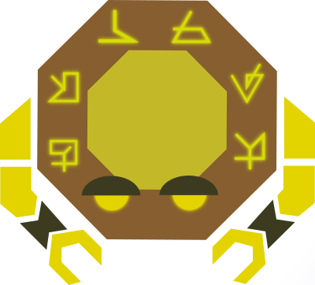

## Průchod hrou
Po zorientování se v hradu musí hráč vykonat následující činosti:
- Nasbírat ingredience do magického elixíru.
- V laboratoři namíchat magický elixír (doplní manu potřebnou pro kouzlení).
- Odemknout s pomocí kouzla dveře do Věže mágů.
- Vstup je zavalený. Hráč musí najít cestu skrz sklepení.
- Ve věži mágů najde vchod do mistrovi pracovny.
- V pracovně najde zápisky a informaci, že musí najít v knihovně zaklínadlo a použít jej na Kognitu
- V pracovně také najde klíč od knihovny
- V knihovně najde svitek s kouzlem
- V trůním sále nalezne kognitu a použije zaklínadlo
- Hra končí

## Grafika
Grafika hry byla vytvořena autorem projektu za pomoci softwaru [Inkscape](https://inkscape.org/).
Bylo třeba navrhnout lokace, ve kterých se bude hra odehrávat. Tyto lokace byly seskládány z jednotlivých assetů. Hra také pracuje s několika předměty, ktré hráč sbírá a interaguje s nimi.
### Předměty
Byliny potřebné k uvaření elixíru
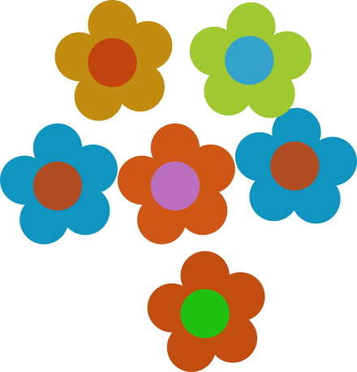

Voda potřebná k uvaření elixíru


Magický krystal potřebný k uvaření elixíru
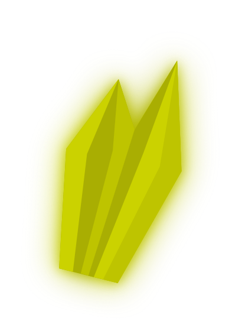

Klíč k odemčení knihovny


Svitek se zaklínadlem pro dokončení Kognity
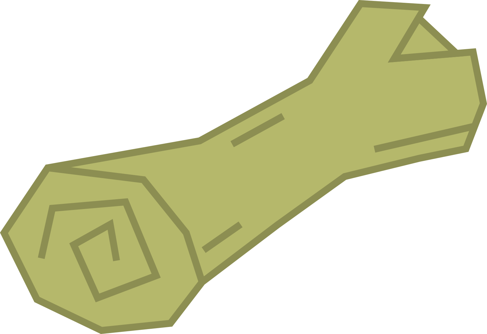

Magický elixír pro doplnění many
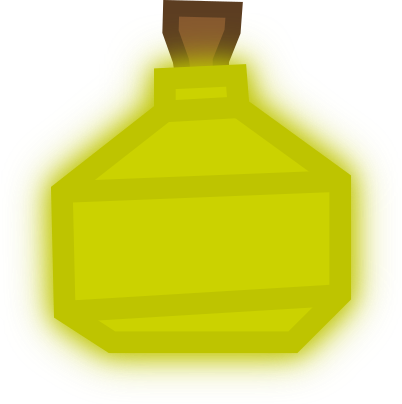

### Lokace

Před branou:
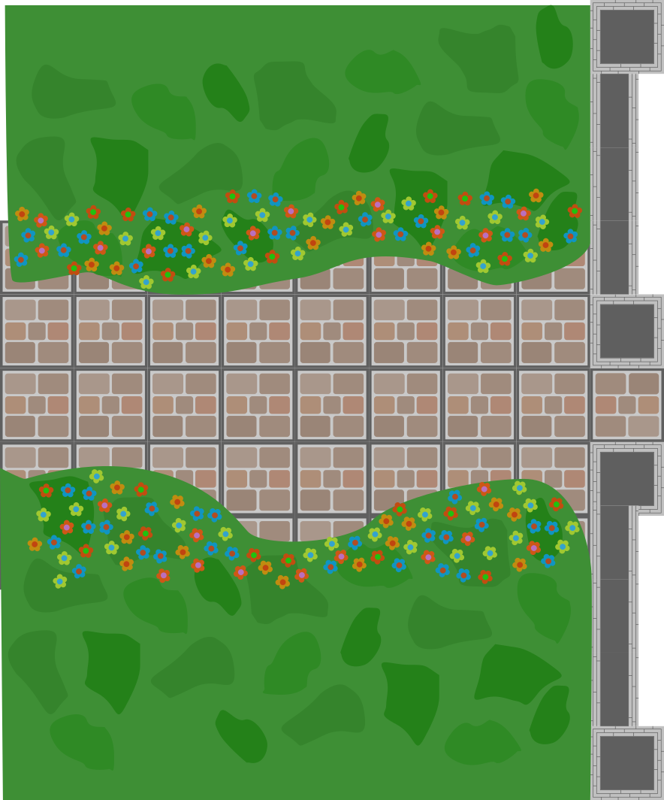

Nádvoří hradu Aethorn:
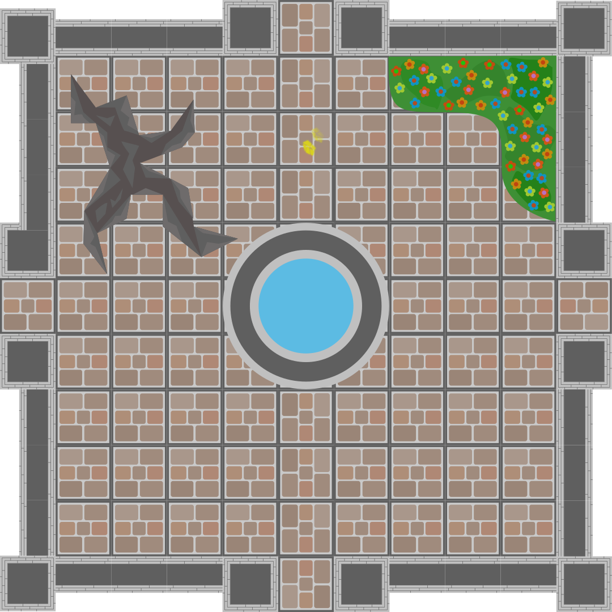

Vstupní síň:
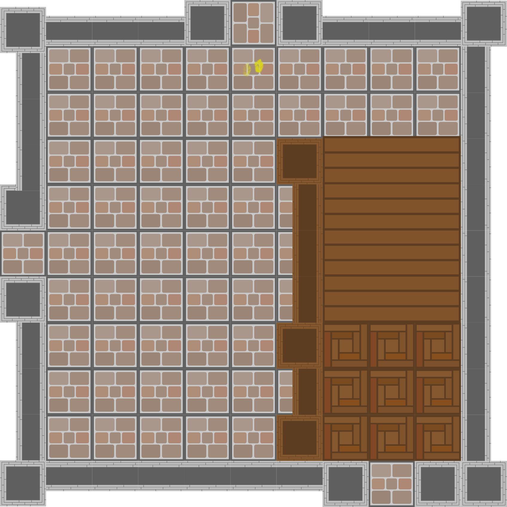

Alchymistická laboratoř:
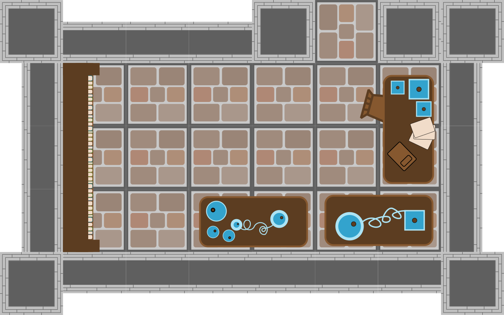

Trůnní sál:
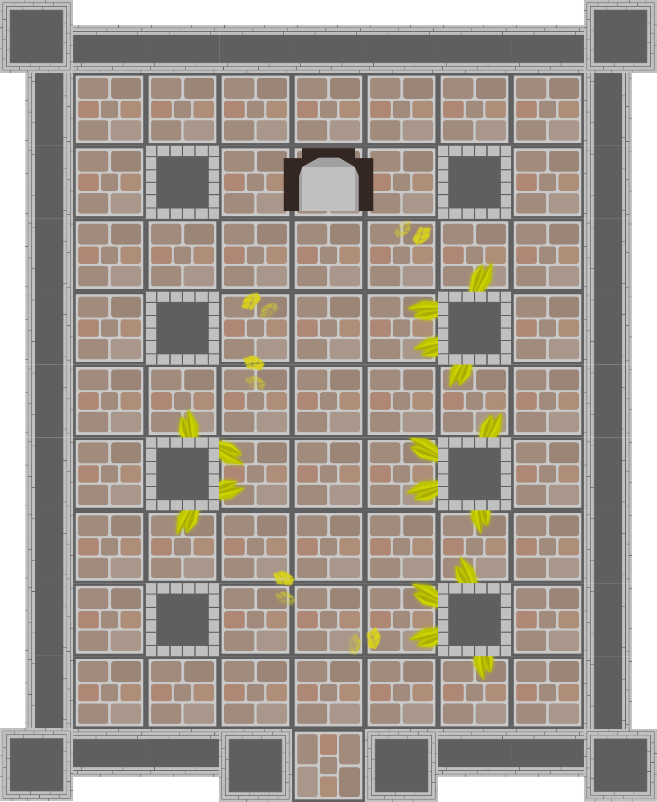

Chodba vedoucí do Věže mágů (sesutý strop):
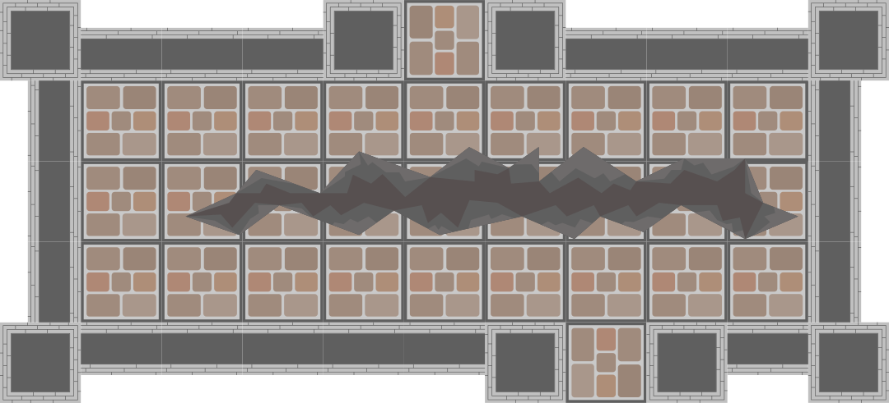

Chodba vedoucí do knihovny a sklepení:
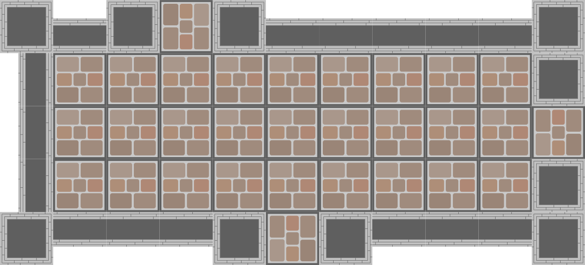

Sklepení:


Věž mágů:
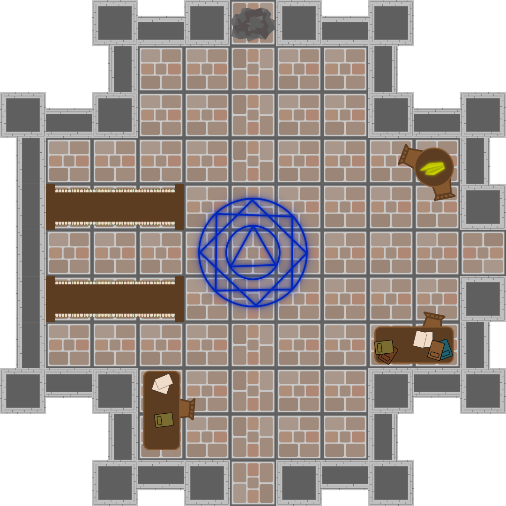

Pracovna mistra Rendyra:
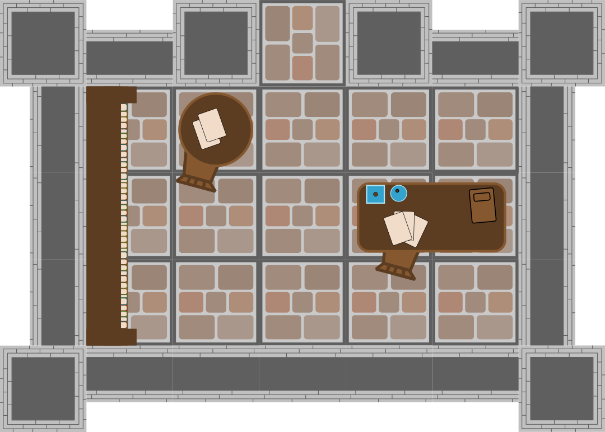

Knihovna:
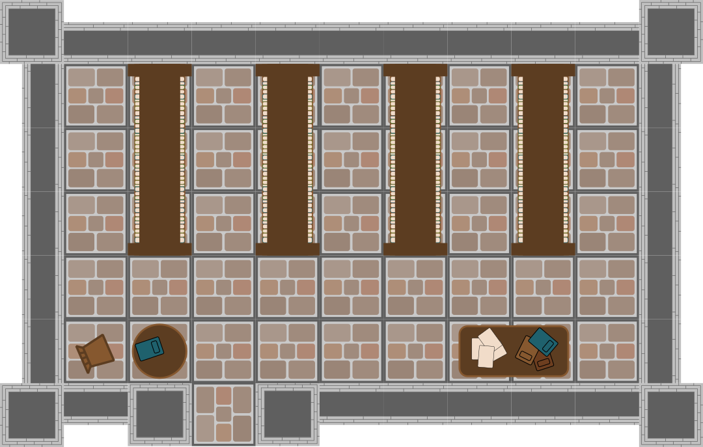

## Animování
Původně měly být animace pohybu postav vytvořeny pomocí softwaru [Synfig](https://www.synfig.org/), který umožňuje snadné definování klíčových snímků, mezi kterými dopočítá zbytek animace. Tento způsob ovšem obsahuje některé nevýhody.

### Nevýhody animovaných videí
- Čas potřebný k naanimování a vyrenderování videa. I krátké video zabere nějaký čas.
- Velikost výsledných souborů. Jedno animované video pohybu obsahuje několik MB dat.

### Alternativní přístup
Především z důvodu úspory dat bylo přikročeno ke způsobu animování, který je náročnější na implementaci, ale ušetří mnoho místa a urychlí načítání aplikace.
Scény, ze kterých se hra skládá budou tvořeny pozadím, obrázkami postav a JSON soubory definujícími pohyby postav. Všechny tyto tři zdroje se velikostí pohybují v desítkách kB.

## Implementace enginu

### Reprezentace scény

Každá scéna je reprezentována JSON souborem, který obsahuje veškeré informace pro správné zobrazení a chodu hry.
Základní struktura scény vypadá takto:
```json
{
    "background": "scene.png",
    "width": 11,
    "objects": [
        {
            ...
        }
    ],
    "animations":[
        ...
    ],
    "solutions":[
        ...
    ],
    "transitions":[
        ...
    ]
}
```
Objekty jsou definovány jejich základními atributy:
```json
{
    "name": "object-name",
    "skin": "costume.png",
    "x": 0,
    "y": 0,
    "direction": 1,
    "visible": true
}
```
Pole animací je složeno z objektů, definovaných takto:
```json
{
    "id": 1,
    "object": "object-name",
    "frames": [
        {
            "x": 2,
            "y": 5,
            "direction": 1
        },
        {
            "x":3,
            "duration": 500
        }
    ],
    "after":[
        {
            "audio": "voda.mp3"
        },
        {
            "additem": "voda"
        },
        {
            "animation": 2
        }
    ]
}
```
Tento objekt definuje jaký objekt je animován, jaké objahuje klíčové snímky (frames) a zda se po dokončení animace mají spustit nějaké další akce (after). Ty mohou obsahovat přehrání zvuku, přidání/odebrání předmětu do/z inventáře či spuštění další animace.
Pole solutions obsahuje informaci o tom, která možná řešení dané situace jsou k dispozici pro určitou pozici hráče a jaký obrázek se má pro toto řešení zobrazovat. V definičním souboru je řešení definováno takto:
```json
{
    "x":2,
    "y":5,
    "conditions": [
        "stopy"
    ],
    "image": "brana-stopy.png",
    "animation": 3
}
```
Atribut animation říká, která animace se má spustit po vybrání tohoto řešení. Pole conditions určuje, zda je řešení k dospozici jen za určitých podmínek. Zde například pouze když je do stavů hry uložen stav "stopy".
Poslední pole, transmitions, definuje přechody mezi scénami. Tedy stojí-li hráč na zadaných souřadnicích(x a y), na kterou scénu se má hra ppřepnout (target) a na kterých souřadnicích cílové scény má hráč stát (tx a ty).
```json
{
    "x": 5,
    "y": 0,
    "target": "chodba-knihovna",
    "tx":5,
    "ty":3
},
```
### Komponenty enginu
- Správce scén - stará se o načítání a přepínání scén
- Inventář - uchovává informace o předmětech, které má hráč u sebe
- Správce stavu hry - uchovává informace o stavu hry, umožňuje uložit stav hry, který ovlivňuje například zobrazovaná řešení situace
- Hrací deska - stará se o vykreslování aktuálně načtené scény
- Správce řešení - načítá řešení pro danou scénu
- Správce zvuků - stará se o přehrávání zvuků a hudby
- UI - stará se o vykreslování uživatelských prvků hry

## Výsledky projektu
Pomocí výše navrženého enginu byla vytvořena demo verze hry Kognita dostupná [zde](https://kraken.pedf.cuni.cz/~syselpet/kognita/). Během tvorby hry byly ovšem identifikovány některé slabiny, které je třeba zmínit.

### Nevýhody enginu
Hlavní nevýhodou je způsob definování animací hry. JSON soubor, který k tomuto účelu slouží se již po první scéně stává příliš dlouhým a nepřehledným.
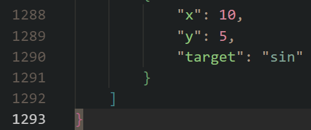
Tento problém by byl řešitelný přidáním editoru, který by umožňoval uživatelsky přívětivější prostředí k tvorvě animací. Například klikáním na políčka, po kterých se má objekt pohybovat.
Dalším problém je zdlouhavost tvorby scén. Tento problém se pojí se samotným principem fungování hry. Pro každou pozici hráče je třeba definovat pohyb ke zbývajícím možným pozicím na scéně (většinou je to n*(n-1) animací + doplňující animace).
Tyto nevýhody zapříčinily to, že nebyla hra dokončena. **Dokončení hry by vyžadovalo příliš mnoho času**.

### Budoucnost projektu
I přes to, že závěr projektu zní, že je tvorba interaktivních her v tomto enginu příliš časově náročná, je v plánu tuto hru dokončit.
Řešením problému s enginem je možnost sloučení s aplikací [Codeblockie](https://codeblockie.com), která již obsahuje editor pro definování úloh pro rozvoj algoritmizace a pro práci s objekty.
Pro to, aby bylo možné tvořit v Codeblockie hry, jako je Kognita, bude třeba přidat některé další funkce, jako například správu inventáře, držení stavu hry napříč scénami (úlohami) a některé další.
Hra Kognita by měla být první kompletní hrou (sadou úloh) vytvořenou pomocí aplikace Codeblockie.